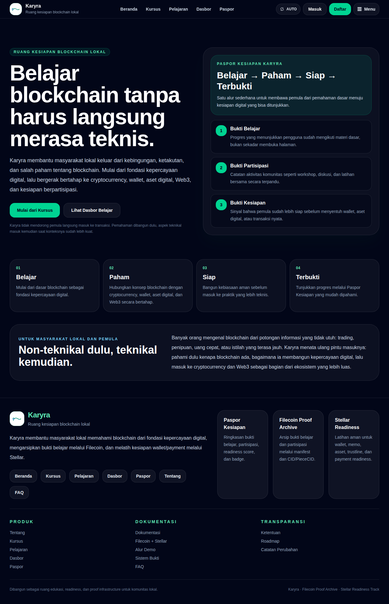
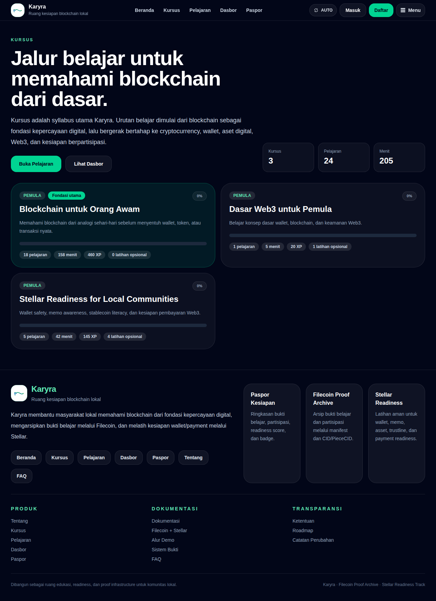
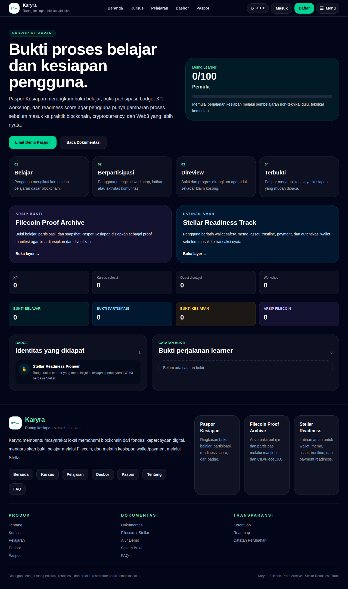
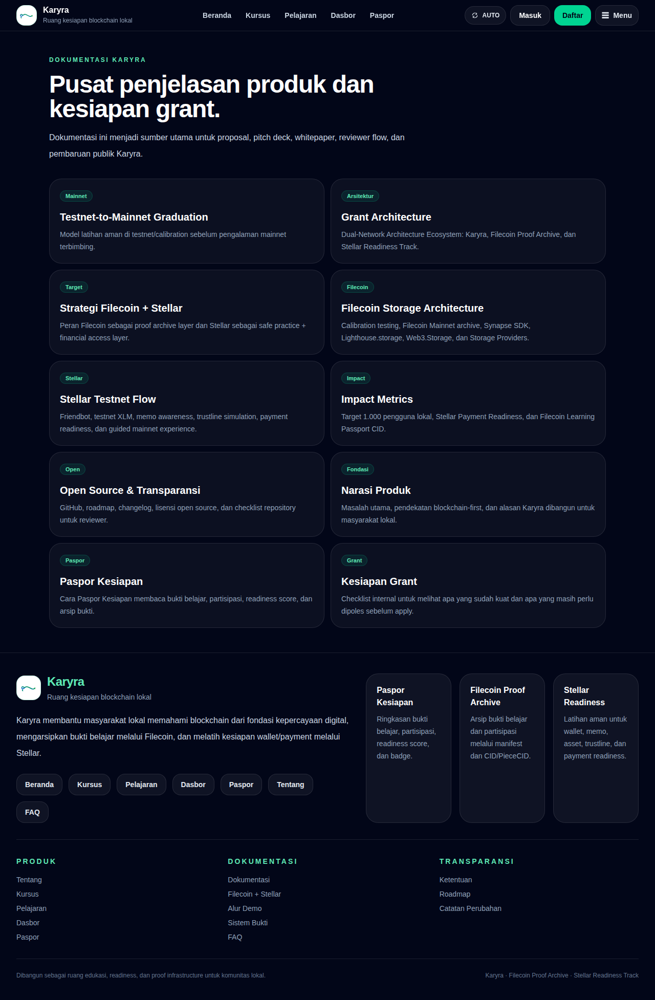

# Karyra

**Karyra** is a local blockchain readiness platform for beginners and local communities.

Karyra helps non-technical learners understand blockchain from simple, human foundations before they move into practical network readiness, decentralized proof archives, payment-readiness practice, and guided mainnet experience.

```txt
Belajar → Paham → Siap → Terbukti
Learn → Understand → Ready → Proven
```

Karyra is not a generic learn-to-earn product and not a trading product. It is being built as **local blockchain readiness infrastructure** for learners, community educators, and workshop organizers.

---

## Core Positioning

Karyra starts from **blockchain as the foundation of digital trust**.

Cryptocurrency, wallets, digital assets, Web3, decentralized storage, and payment networks are introduced gradually as parts of the broader blockchain ecosystem.

Karyra focuses on the pre-transaction layer of adoption:

- blockchain literacy before asset usage
- safety awareness before direct network interaction
- testnet practice before mainnet experience
- proof of learning before deeper technical steps
- proof of participation before community progression
- readiness records before real onchain activity
- local and offline onboarding for beginner communities

---

## Proof Model

Karyra is organized around three proof pillars:

```txt
Proof-of-Learning
Proof-of-Participation
Proof-of-Readiness
```

These proofs are reflected through course completion, learner progress, workshop participation, optional quest submissions, badge identity, readiness scores, proof records, and the Readiness Passport.

---

## Dual-Network Architecture

Karyra uses a dual-network architecture direction:

```txt
Karyra   = Local Blockchain Readiness Platform
Filecoin = Decentralized Proof Archive / Storage Layer
Stellar  = Micro-payment & Financial Access Readiness Layer
```

Filecoin is positioned as Karyra's decentralized proof archive layer. Karyra prepares learning and participation evidence as proof manifests that can later be archived, retrieved, and verified through Filecoin-related tooling.

```txt
Local proof manifest
→ Filecoin Calibration testing
→ mainnet-readiness review
→ Filecoin Mainnet official proof archive
```

Stellar is positioned as Karyra's financial access and micro-payment readiness layer. It is used to teach safe wallet and payment-readiness concepts, not speculation.

```txt
Stellar Testnet practice
→ Stellar Payment Readiness completion
→ guided Stellar Mainnet experience
→ readiness proof in Passport
```

---

## Testnet-to-Mainnet Graduation Model

Karyra does not bring beginners directly to mainnet.

```txt
Learn concepts
→ practice safely on testnet / calibration
→ complete readiness track
→ unlock guided mainnet experience
→ record proof in Readiness Passport
```

Mainnet is treated as a graduation step, not as the first door for beginners.

---

## Current MVP Highlights

### Learning Engine

- public course catalog
- course detail page
- lesson reader/player
- module and lesson ordering
- blockchain-first course priority
- lesson completion flow
- learner dashboard
- progress tracking

### Readiness Passport

- readiness score and level
- proof counts
- badge identity
- proof records
- Filecoin Proof Archive visibility
- Stellar Readiness visibility
- passport demo flow
- readiness documentation

### Filecoin + Stellar

- Filecoin Proof Archive page
- Stellar Readiness Track page
- Filecoin + Stellar product documentation
- Testnet-to-mainnet graduation documentation
- Filecoin Storage Architecture documentation
- Stellar Testnet Flow documentation

### Community and Transparency

- workshop registration
- public documentation hub
- demo flow
- roadmap
- changelog
- status page
- MIT License

---

## Main Routes

### Core Learning

```txt
/                                      Homepage
/courses                               Course catalog
/courses/[slug]                        Course detail
/lessons                               Lesson library
/lessons/[slug]                        Lesson reader
/dashboard                             Demo learner dashboard
/passport                              Readiness Passport
/passport/demo                         Passport demo explanation
```

### Filecoin + Stellar

```txt
/filecoin-proof-archive                Filecoin Proof Archive layer
/stacks/stellar-readiness              Stellar Readiness Track
/docs/filecoin-stellar                 Filecoin + Stellar strategy
/docs/filecoin-architecture            Filecoin storage architecture
/docs/stellar-testnet-flow             Stellar testnet and readiness flow
/docs/mainnet-graduation               Testnet-to-mainnet graduation model
```

### Documentation

```txt
/docs                                  Documentation hub
/docs/product-narrative                Product narrative
/docs/readiness-passport               Readiness Passport docs
/demo-flow                             Demo flow
/proof-system                          Proof model overview
```

### Community / Transparency

```txt
/workshops                             Public workshop page
/workshop-kit                          Workshop support material
/status                                Public project status
/changelog                             Public changelog
/roadmap                               Public roadmap
/about                                 About Karyra
/faq                                   FAQ
/terms                                 Terms and Conditions
```

---

## Screenshots

A few representative views from the current public demo:

### Homepage

<<<<<<< HEAD
## Screenshots

A few representative views from the current public demo:

### Homepage



### Course Catalog



### Readiness Passport



### Documentation Hub



More desktop and mobile screenshots are available in `public/karyra_screenshots/`.

---

## Impact Target Draft
=======


### Course Catalog


### Readiness Passport


### Documentation Hub


More desktop and mobile screenshots are available in `public/karyra_screenshots/`.

---

## Tech Stack

```txt
Framework: Next.js App Router
Language: TypeScript
Database: PostgreSQL
ORM: Prisma 7.8.0
Prisma Adapter: @prisma/adapter-pg
Generated Prisma Client: src/generated/prisma
Runtime: Node.js
Styling: Tailwind CSS v4
Validation: Zod
Deployment direction: VPS-first / self-hosted
Process manager: PM2 / Node.js server
```

Important project decisions:

```txt
Prisma version: 7.8.0
Generated client path: src/generated/prisma
Module system: ESM
Database: PostgreSQL
Deployment direction: self-hosted VPS-first
Canonical product copy: Bahasa Indonesia first
```

---

## Environment

Create a local `.env` file and configure at least:

```txt
DATABASE_URL
NODE_ENV
```

Never commit `.env`.

Recommended database separation for deployment:

```txt
karyra_dev
karyra_preview
karyra_prod
```

---

## Installation

```bash
npm install
```

---

## Prisma Commands

```bash
npm run db:format
npm run db:generate
npm run db:seed
npm run db:seed:demo
npm run db:seed:blockchain
npm run db:smoke
```

For production deployments with existing migrations:

```bash
npx prisma migrate deploy
```

---

## Development

```bash
npm run dev
```

Open:

```txt
http://localhost:3000
```

---

## Verification

```bash
npm run typecheck
npm run build
```

If available:

```bash
npm run app:audit
npm run app:verify
```

---

## Deployment Notes

The current deployment direction is VPS-first with Node.js and PM2.

Example deployment flow:

```bash
git pull origin main
npm install
npm run db:generate
npx prisma migrate deploy
npm run db:seed
npm run db:seed:blockchain
npm run build
pm2 delete karyra || true
pm2 start npm --name karyra -- start
pm2 save
```

If the host requires binding to all interfaces:

```bash
next start -H 0.0.0.0 -p 3000
```

---

## MVP Limitations

The current MVP intentionally keeps several areas simple:

- full authentication is not enabled yet
- role-based permission system is planned later
- some learner identity flows still use demo learner mode
- quest verification is currently based on manual/admin review
- Filecoin archive integration is currently documented and demo-oriented, not yet full mainnet storage automation
- Stellar readiness currently focuses on education and graduation design, not a full production wallet flow
- workshop attendance/check-in can be expanded later
- AI-assisted content generation is planned but not active yet

---

## Roadmap Direction

### Phase 1 — Core Learning Foundation

- course and lesson engine
- lesson completion
- learner dashboard
- progress tracking
- blockchain-first learning path

### Phase 2 — Readiness & Proof System

- Readiness Passport
- proof records
- badge identity
- proof system overview
- Filecoin Proof Archive visibility
- Stellar Readiness Track visibility

### Phase 3 — Dual-Network Readiness

- Stellar Testnet practice flow
- Friendbot / testnet XLM exercise
- trustline and memo simulation
- Filecoin Calibration proof archive testing
- proof manifest upload testing

### Phase 4 — Guided Mainnet Experience

- Stellar Mainnet guided financial access experience
- Filecoin Mainnet official proof archive
- passport proof verification
- storage policy and renewal strategy

### Phase 5 — Public Pilot

- pilot workshops
- screenshot and demo package
- impact reporting
- public documentation polish

---

## Product Direction

Karyra is designed for:

- blockchain beginners
- local Indonesian communities
- offline learning workshops
- beginner-friendly wallet education
- Stellar payment-readiness learning
- Filecoin proof archive literacy
- local community onboarding
- future chain-aware learning identity

Karyra's long-term vision is to become a community-based blockchain readiness and proof-of-learning ecosystem for local communities.

---

## License

This project is licensed under the MIT License. See [LICENSE](./LICENSE).
